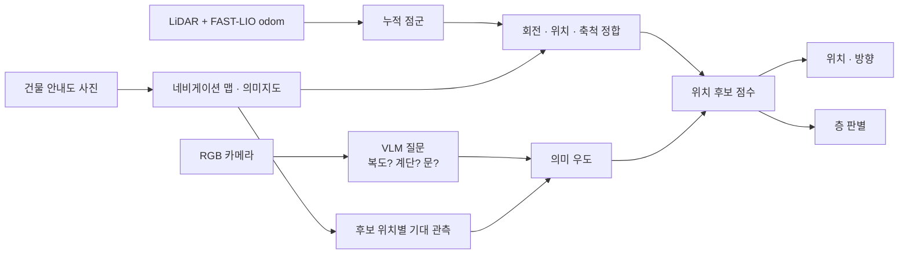
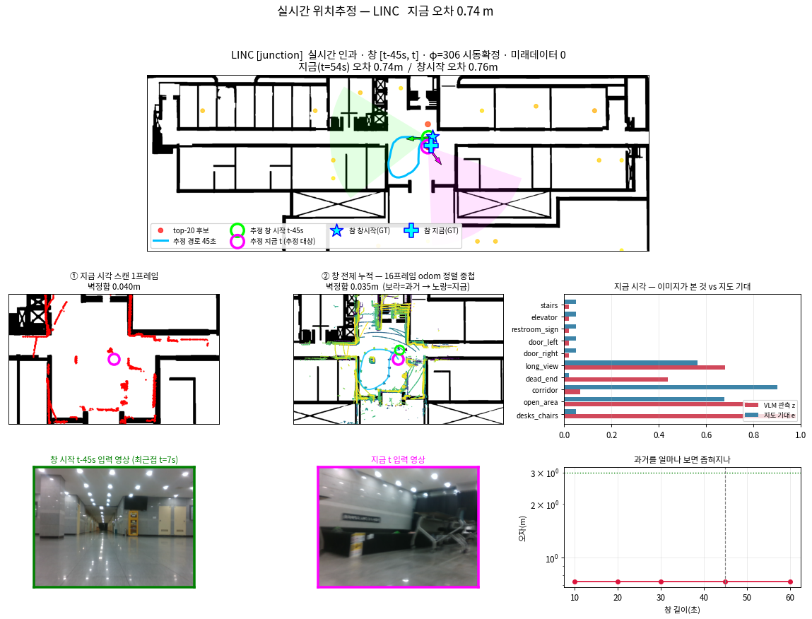
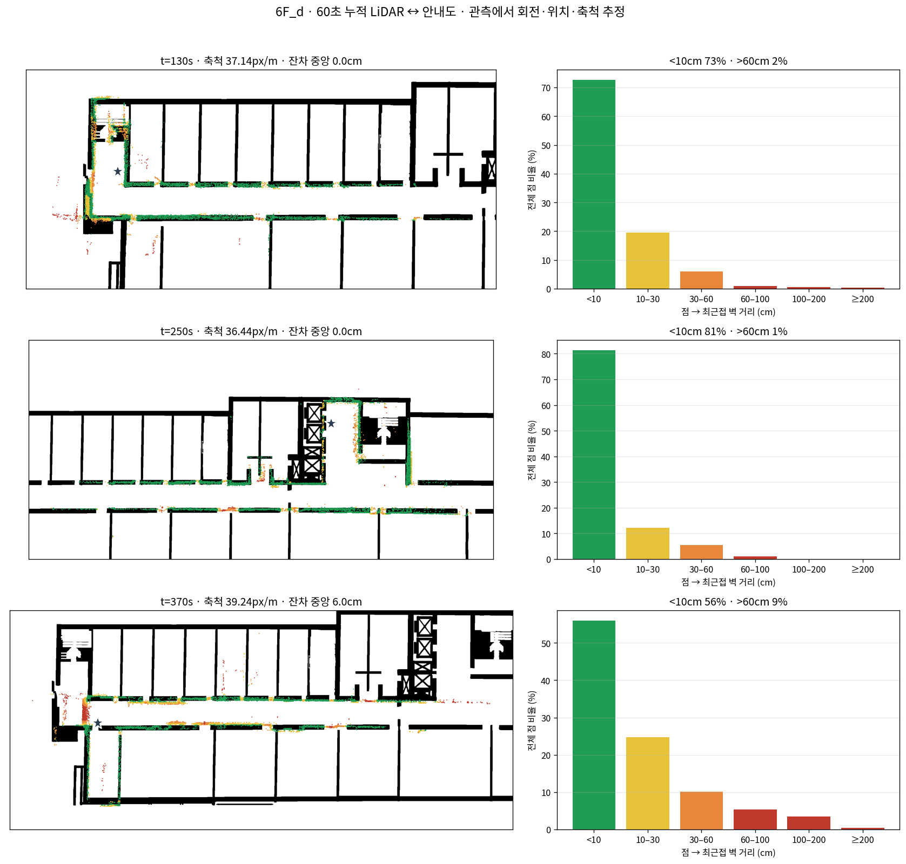

# Floorplan-Localization

건물 안내도 사진만으로 4족 보행 로봇(Unitree Go2)의 위치와 층을 찾는 연구입니다. CAD 도면이나 미리 만든 LiDAR 지도 없이, 안내도에서 만든 2D 지도에 누적 LiDAR 점군과 카메라 의미 정보를 맞춰 위치·방향·축척·층을 추정합니다.

> 진행 중인 연구라 일부 모듈만 공개합니다. 위치추정 본체와 주행 데이터는 포함하지 않았습니다.

## 파이프라인

지도 생성은 [Floorplan-SemanticMap](https://github.com/gimsiyeong49-alt/Floorplan-SemanticMap)에서 다룹니다.

## 결과

### 4층: 누적 LiDAR 단독 위치추정

층을 알려준 상태에서 4층 33개 시점을 60초씩 누적해 맞춘 결과입니다. 의미 정보는 쓰지 않았습니다. 축척을 알고 있으면 중앙 오차 0.71 m에 3 m 이내가 91%, 축척까지 함께 추정하면 1.05 m에 94%입니다.

여기서는 축척이 성패를 가릅니다. 맞는 범위가 −1%~+4%로 좁아서 5%만 벗어나도 결과가 무너집니다.

### 4층: 실시간 위치추정 (LiDAR + VLM)

미래 데이터 없이 직전 30초만 보고 돌린 결과입니다. 시동 15초에 방향을 확정하고 의미 가중은 λ=0.5로 두었습니다. held-out 5지점에서 중앙 오차 0.74 m, 3 m 이내가 4/5입니다. 화면의 빨강은 카메라 이미지에 질문해 얻은 확률이고, 파랑은 지도에서 계산한 기대값입니다.

### 다른 층: 누적 LiDAR와 안내도 정합

60초 동안 누적한 점군을 안내도에 맞춰 회전·위치·축척을 함께 추정합니다. 6층 세 시점에서 점의 56~81%가 안내도 벽 10 cm 안에 놓입니다.

### 층 판별: 복도만 보면 층을 가릴 수 없다

층 정보가 전혀 없는 합성 직선 복도를 9개 층 지도와 겨루게 했습니다. 실제 관측이 아닌데도 3층이 1위(점수 3.99)로 나옵니다. 판정이 관측이 아니라 지도에 복도가 얼마나 많은지에 끌린다는 뜻입니다. 지금은 관측이 설명하지 못하는 지도 벽에도 벌점을 주는 양방향 정합과, 해치·메워진 면 같은 가짜 벽 제거를 넣고 있습니다.

## 공개한 코드

| 파일 | 내용 |
|---|---|
| [`src/vlm_scene.py`](src/vlm_scene.py) | Qwen3-VL-2B에 yes/no 질문 17개(복도·계단·문·엘리베이터 등)를 던져 0~1 관측 확률로 변환 |
| [`src/semantic_map.py`](src/semantic_map.py) | 의미지도에서 후보 위치·방향마다 "보여야 할 것"의 기대값 계산 (시야각·가시선·거리) |
| [`src/twoway.py`](src/twoway.py) | 관측→벽, 벽→관측 양방향 섹터 잔차 점수 |
| [`src/wall_clean.py`](src/wall_clean.py) | 해치·메워진 면 같은 가짜 벽 제거 (임계값은 그 지도 벽 두께의 배수) |

## 환경

Unitree Go2에 Hesai XT16 라이다와 RealSense D435i 카메라를 달고 씁니다. 소프트웨어는 Ubuntu 22.04, ROS 2 Humble, Python 3.10(NumPy, SciPy, PyTorch, Transformers)이고, 오도메트리는 [FAST_LIO](https://github.com/gimsiyeong49-alt/FAST_LIO)에서 받습니다.
